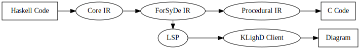
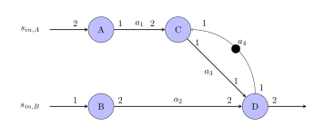

# Project Overview
This document provides a comprehensive overview of the ForSyDe DevTools project, including its goals, structure, and the languages employed in its development and use. It also includes programming guidelines on how to write code that can be correctly compiled by the tool.

# Table of Contents

- [Project Overview](#project-overview)
- [Table of Contents](#table-of-contents)
- [Project Objectives](#project-objectives)
- [Project Structure](#project-structure)
  - [Haskell](#haskell)
    - [GHC.Core](#ghccore)
  - [ForSyDe](#forsyde)
    - [ForSyDe Shallow](#forsyde-shallow)
      - [ForSyDe Shallow SDF](#forsyde-shallow-sdf)
  - [ForSyDe IR](#forsyde-ir)
  - [Compiler](#compiler)
    - [Static Scheduling](#static-scheduling)
    - [Procedural IR](#procedural-ir)
    - [C Code](#c-code)
  - [Visualiser](#visualiser)
    - [KLighD](#klighd)
    - [Language Server Protocol](#language-server-protocol)
    - [Graphical Representation](#graphical-representation)
  - [Testing](#testing)
- [Programming Guidelines/Restrictions](#programming-guidelinesrestrictions)

# Project Objectives
Create and document two development tools, one to compile, and one to visualise the SDF model subset of the ForSyDe modelling language framework. 
This is done by implementing:
- [SDF models](https://hackage.haskell.org/package/forsyde-shallow-3.5.0.0/docs/ForSyDe-Shallow-MoC-SDF.html) including: 16 general actors and a delay actor. 
- Integer arithmetic operations including: adding, subtracting, multiplying, and negation. 
- Visualiser takes the form of a VS Code extension using the [KIELER](https://github.com/kieler) library. 
- Compiler generates C code that runs bare metal in a standard Linux PC environment and on a Pico 2 embedded board. 
  
Optional Goals: 
- Explore compiling to new hardware platform (Jetson Nano and Jetson Thor), other Model of Computations, and other languages. 
- Static multicore scheduling with blocking read/write buffers between cores. 
- Automatic multicore scheduling using Design Space Exploration tools. 

# Project Structure
The following picture represents the whole structure of the ForSyDe DevTools project. The rectangular shapes represent an input or output component, while the elliptical shapes represent transitions between components.

## Haskell
[Haskell](https://www.haskell.org/) is a declarative, statically typed, lazy and purely functional programming language. It serves as the base for ForSyDe DevTools since it is both the implementation language of the ForSyDe DevTools and the primary language used to write models that can be compiled by the tool. [The Glasgow Haskell Compiler (GHC)](https://www.haskell.org/ghc/) version 9.10.2 is used to compile Haskell and [Cabal](https://www.haskell.org/cabal/) is used to build Haskell projects.

If you want a quick start with Haskell, please consult the Haskell [Get started](https://www.haskell.org/get-started/) page. If you want to learn Haskell, there are multiple free resources online. The ForSyDe DevTools team recommends the book [Learn You a Haskell for Great Good!](https://learnyouahaskell.github.io/introduction.html) and the two YouTube playlists by Professor [Graham Hutton](https://people.cs.nott.ac.uk/pszgmh/), [Functional Programming in Haskell](https://www.youtube.com/playlist?list=PLF1Z-APd9zK7usPMx3LGMZEHrECUGodd3) and [Advanced Functional Programming in Haskell](https://www.youtube.com/playlist?list=PLF1Z-APd9zK5uFc8FKr_di9bfsYv8-lbc)

### GHC.Core
[GHC.Core](https://hackage-content.haskell.org/package/ghc-9.10.2/docs/GHC-Core.html) is an explicitly typed intermediate representation used by the GHC compiler and acquired via the GHC APIs. It results from a series of systematic normalisations that transform Haskell code into a simpler form while preserving all language features. The resulting Core program is procedural in nature, making it more compatible with C than the original Haskell source. To know more about Core, please consult the [Core IR](core-ir.md) documentation.

## ForSyDe
[ForSyDe](https://forsyde.github.io/), which stands for Formal System Design, is a methodology for designing a system that is correct-by-construction by emphasising formal-based high-level modelling and abstraction, as well as conducting verification early in the design process. ForSyDe provides the means to implement models at high levels of abstraction through a Haskell program.

### ForSyDe Shallow
[ForSyDe-Shallow](https://forsyde.github.io/forsyde-shallow/) is the first and longest-standing version of the ForSyDe modeling framework. It is implemented as a shallow-embedded domain-specific language (EDSL) in Haskell, it supports modeling, simulation, and early design validation of heterogeneous embedded and cyber-physical systems. The framework builds on the principles of models of computation (MoC) while leveraging Haskell’s pure functions and higher-order abstractions. A getting-started tutorial for ForSyDe-Shallow can be found [here](https://forsyde.github.io/forsyde-shallow/getting_started#getting-started-with-forsyde-shallow). There is also a [setup guide](https://forsyde.github.io/forsyde-shallow/setup), an [API documentation page](https://hackage.haskell.org/package/forsyde-shallow), and an [example project](https://github.com/forsyde/forsyde-shallow-examples) repository.

#### ForSyDe Shallow SDF
[ForSyDe.Shallow.MoC.SDF](https://hackage.haskell.org/package/forsyde-shallow-3.5.0.0/docs/ForSyDe-Shallow-MoC-SDF.html) is the list of models that follows the [Synchronous Data Flow (SDF)](https://en.wikipedia.org/wiki/Synchronous_Data_Flow) MoC. SDF is a model in which the amount of data that is consumed and produced by each actor is fixed and known beforehand. 

An example SDF graph is shown below, where actors are depicted as blue circles, with directed edges showing the direction of the flow of data and the annotated numbers describing how many tokens are consumed and produced by each actor.

## ForSyDe IR
ForSyDe IR is a custom intermediate representation built by the ForSyDe DevTools team. It serves as the basis for the compiler and visualiser. The documentation of ForSyDe IR can be found in [ForSyDe IR](forsyde-ir.md) documentation.

## Compiler
The compiler performs Static Scheduling on ForSyDe IR, uses the information from the scheduling and the ForSyDe IR to transform them into Procedural IR, and then transforms the Procedural IR to C code.

### Static Scheduling
In order to correctly implement a Synchronous Data Flow (SDF) graph, the communication semantics of the data flow model must be preserved. This means an actor can only fire when enough input data is available and sufficient output buffer space exists.

The implementation of the SDF must:
- Determine the necessary FIFO buffer sizes for each arc.
- Derive a schedule ensuring actors fire only when data is ready.

Scheduling can be:
- Dynamic, using a runtime scheduler (e.g., RTOS).
- Static, determined at compile time, allowing for efficient bare-metal execution.

ForSyDe Devtools implement, static scheduling. There are two static schedules to choose from:
- PASS – Periodic Admissible Sequential Schedule (for single processors)
- PAPS – Periodic Admissible Parallel Schedule (for parallel systems)

ForSyDe DevTools currently implements PASS only.

In order to know if a PASS exists, a topology matrix Γ should be first constructed. In Γ, the entry of row i and column j is the number of tokens produced (positive number) or consumed (negative number) by node j on arc i. If a SDF graph with s nodes has rank(Γ) = s − 1 then a PASS exists.

If a PASS exists for a SDF-graph, it is possible to give a repetitions vector, which describes how many times a certain node will be fired.

With the repetitions vector and the token rates for the SDF-graph, the system can be simulated in order to figure out the exact buffer sizes.

The documentation of static scheduling in ForSyDe DevTools can be found in [Scheduling documentation](scheduling.md). All theory presented in this section is derived from this [paper](https://www.icas.org/icas_archive/ICAS2022/data/papers/ICAS2022_0604_paper.pdf). In addition to the reference papers [1](https://ieeexplore.ieee.org/document/1458143), [2](https://ieeexplore.ieee.org/document/5009446), and [3](https://www.taylorfrancis.com/books/mono/10.1201/9781420048025/embedded-multiprocessors-sundararajan-sriram-shuvra-bhattacharyya).

### Procedural IR
The Procedural IR is a custom intermediate representation built by the ForSyDe DevTools team. It serves as the basis for C code generation.

The IR is heavily inspired by the Cigrid Language Reference Manual created by David Broman for the Compilers and Execution Environments (ID2202) course at KTH.

The documentation of Procedural IR in ForSyDe DevTools can be found in [Procedural IR](procedural-ir.md) documentation.

### C Code
C code generation is the last step in the compiler. The generated C code is a structural pretty printed from of Procedural IR. The generation also depends on the C code templates and libraries which are described in [c-code Templates](c-code-templates.md) documentation.

## Visualiser
The Visualiser continues from the ForSyDe Intermediate Representation,
which has all the information needed to make a graph as it is basically already a graph representation.
The process constructors make up the nodes and the signals make up the edges
(including global inputs and outputs).

This representation still needs to be transformed into another which
contains information on how it should be displayed.

### KLighD
KIELER Lightweight Diagrams is the backend for the visualisation,
specifically the [KLighD-VSCode](https://github.com/kieler/klighd-vscode)
variant.

### Language Server Protocol
To facilitate integration with KLighD, VSCode, and possibly other IDEs,
the visualiser implements the Language Server Protocol for communication.

KLighD communicates through the [Diagram Server API](https://github.com/kieler/klighd-vscode/wiki/Diagram-Server-Communication-%E2%80%90-Architectural-Overview),
which is built on top of the Language Server Protocol.
It is described through JSON Schema [in the repository](https://github.com/kieler/klighd-vscode/tree/main/schema)
though that is not yet complete with all features KLighD-VSCode supports.

### Graphical Representation 
- TODO

## Testing
Testing is crucial to check the correctness and the integrity of the work. Tests are manually written and exposed to a test suite in order to execute them. The documentation of the testing in ForSyDe DevTools can be found in [Testing](testing.md) documentation.

# Programming Guidelines/Restrictions
The following is a set of programmer restrictions which limit what the compiler accepts as input Haskell and ForSyDe code.

- The input program should be a correct Haskell/ForSyDe program. ForSyDe DevTools currently does not have any input validity checking mechanisms.
- "where" scopes are not allowed to be nested except for the initial module scope.
- "if" expressions are not allowed inside "system"
- Net lists can only be defined using the identifier "system"
- Type signatures should be written for all defined functions.
- Current implementation support only "system" with one or two outputs.

Accurate examples can be found in [examples/model](examples/model) folder. It is highly recommended to read through them and follow their style when using the ForSyDe DevTools.

