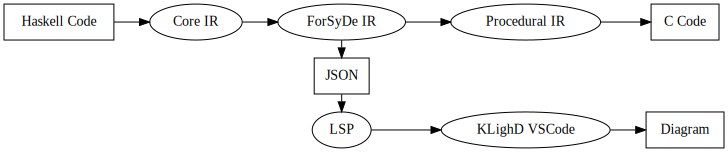

# Project Overview
This document provides a comprehensive overview of the ForSyDe DevTools project, including its goals, structure, and the languages employed in its development and use. It also includes programming guidelines on how to write code that can be correctly compiled by the tool.

# Table of Contents

- [Project Overview](#project-overview)
- [Table of Contents](#table-of-contents)
- [Project Objectives](#project-objectives)
- [Project Structure](#project-structure)
  - [Haskell](#haskell)
    - [GHC.Core](#ghccore)
  - [ForSyDe](#forsyde)
    - [ForSyDe Shallow](#forsyde-shallow)
  - [ForSyDe IR](#forsyde-ir)
  - [Compiler](#compiler)
    - [Procedural IR](#procedural-ir)
    - [C code](#c-code)
  - [Visualiser](#visualiser)
    - [JSON](#json)
    - [Language Server Protocol](#language-server-protocol)
    - [KlightD VSCode](#klightd-vscode)
    - [Graphical Representation](#graphical-representation)
  - [Testing](#testing)
- [Programming Guidelines/Restrictions](#programming-guidelinesrestrictions)

# Project Objectives
Create and document two development tools, one to compile, and one to visualise the SDF model subset of the ForSyDe modelling language framework. 
This is done by implementing:
- [SDF models](https://hackage.haskell.org/package/forsyde-shallow-3.5.0.0/docs/ForSyDe-Shallow-MoC-SDF.html) including: 16 general actors and a delay actor. 
- Ineger arithmetic operations including: adding, subtracting, multiplying, and negation. 
- Visualiser takes the form of a VScode extension using the [KIELER](https://github.com/kieler) library. 
- Compiler generates C code that runs bare metal in a standard Linux PC environment and on a Pico 2 embedded board. 
  
Optional Goals: 
- Explore compiling to new hardware platform (Jetson Nano and Jetson Thor), other Model of Computations, and other languages. 
- Static multicore scheduling with blocking read and blocking writes for buffers between cores. 
- Automatic multicore scheduling using Design space exploration tools. 

# Project Structure
The following picture represents the whole structure of the ForSyDe DevTool project. The rectangular shapes present an input or output component, while the spherical shapes present transitions between components.

## Haskell
[Haskell](https://www.haskell.org/) is a declarative, statically typed, lazy and purely functional programming language. It serves as the base for ForSyDe DevTools since it is both the implementation language of the ForSyDe DevTools and the primary language used to write models that can be compiled by the tool. [The Glasgow Haskell Compiler (GHC)](https://www.haskell.org/ghc/) version 9.10.2 is used to compile Haskell and [Cabal](https://www.haskell.org/cabal/) is used to build Haskell projects.

If you want a quick start with Haskell, please consult the Haskell [Get started](https://www.haskell.org/get-started/) page. If you want to learn Haskell, there are multiple free resources online. The ForSyDe DevTools team recommends the book [Learn You a Haskell for Great Good!](https://learnyouahaskell.github.io/introduction.html) and the two YouTube playlists by Professor [Graham Hutton](https://people.cs.nott.ac.uk/pszgmh/), [Functional Programming in Haskell](https://www.youtube.com/playlist?list=PLF1Z-APd9zK7usPMx3LGMZEHrECUGodd3) and [Advanced Functional Programming in Haskell](https://www.youtube.com/playlist?list=PLF1Z-APd9zK5uFc8FKr_di9bfsYv8-lbc)

### GHC.Core
[GHC.Core](https://hackage-content.haskell.org/package/ghc-9.10.2/docs/GHC-Core.html) is an explicitly typed intermediate representation used by the GHC compiler and acquired via the GHC APIs. It results from a series of systematic normalisations that transform Haskell code into a simpler form while preserving all language features. The resulting Core program is procedural in nature, making it more compatible with C than the original Haskell source. To know more about Core, please consult the [ghc-core.md](ghc-core.md) file

## ForSyDe

### ForSyDe Shallow

## ForSyDe IR

## Compiler

### Procedural IR

### C code

## Visualiser

### JSON

### Language Server Protocol

### KlightD VSCode

### Graphical Representation 

## Testing

# Programming Guidelines/Restrictions