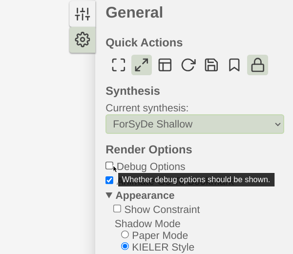
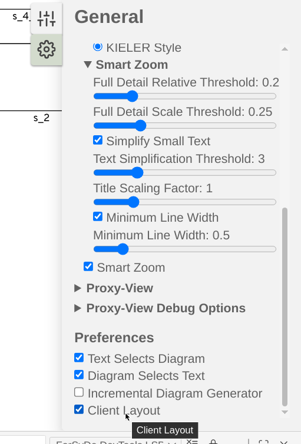

# User Guide
This user guide provides usage information for the ForSyDe DevTools compiler, language server, and VSCode visualiser extension. Additionally, the guide outlines the programming restrictions which need to be followed when developing ForSyDe Shallow models for these development tools.

## Using the compiler
The output of the usage and help prompts for the ForSyDe DevTools compiler is shown below for reference:

```sh
$ forsyde-compiler-exe --help
ForSyDe DevTools

Usage: forsyde-compiler-exe INPUT [(-o|--output OUTPUT) | --stdout] 
                            [--output-c | --output-core | --output-forsyde-ir | 
                              --output-forsyde-ir-json | 
                              --output-procedural-ir | --output-schedule] 
                            [-t|--target TARGET] [--input-type INPUTTYPE] 
                            [--runs RUNS] [--forsyde-pkgpath ARG]

  Compile a ForSyDe model

Available options:
  INPUT                    Input filename
  -o,--output OUTPUT       Output filename
  --stdout                 Print output to stdout
  --output-c               Output file in C (default)
  --output-core            Output file in Core
  --output-forsyde-ir      Output file in ForSyDe-IR
  --output-forsyde-ir-json Output file in ForSyDe-IR-JSON
  --output-procedural-ir   Output file in Procedural-IR
  --output-schedule        Output the SDF schedule to file instead of code
  -t,--target TARGET       Target platform for C code. (PC default, PC and PICO2
                           supported)
  --input-type INPUTTYPE   Source of input tokens for the SDF models in the C
                           code. (stdin default, stdin and predefined supported)
  --runs RUNS              How many times to loop input data, when input mode is
                           set to 'predefined'. 1 By default, pass an integer
                           for a limited number or 'inf' to run the program
                           perpetually
  --forsyde-pkgpath ARG    The path to the ForSyDe Shallow package (unspecified
                           by default)
  -h,--help                Show this help text
```

By default the compiler will output a file named `main` with a specific extension depending on the output format.
This can be overriden by either `--stdout` or `--output <name>`.

To build the C output, the header files located at `examples/implementation/platform_independent/include` are needed. This can be accomplished by adding the include path to the compiler:
```sh
gcc -I examples/model/implementation/platform_independent <generated output>
```

Another option is to link the directory to where you are building it:
```sh
ln -s $PWD/examples/model/implementation/platform_independent/include <build directory>
```

To build the version for the ES-LabKit you need an existing project of the [ES-Lab-Kit](https://gits-15.sys.kth.se/mabecker/ES-Lab-Kit.git) repository created with `newembproj -noRTOS <name>`.
Specify `--target=PICO2` to `forsyde-compiler-exe` so the right headers are included.
Link the include directory as above and build according to the instructions.
There is some additional documentation to the ES-Lab-Kit which can be useful at [docs/es-labkit-board.md](docs/es-labkit-board.md) if you are working with the board.

## Using the VSCode extension

Once the extension is installed, it can be used on supported models. To try it
out, select one from the `examples/model` directory, e.g. `SDF_example_002.hs`.
Select "Open in Diagram" from the right-click menu inside the source file
editor if it does not open automatically.

If you see no image the first time that is expected. This is due the client
layout being disabled by default in the KLighD extension. In the cog-wheel of
the diagram window, first check "Debug Options" and then check "Client
Layout" at the bottom of the settings list which should make the diagram
visible. The setting should persist, but if you get no diagram it is a good
thing to check.




Once you have a diagram, you can get to the source code related to the visual
element being rendered by clicking on it, which will select it in the window
with the source code editor. The language server currently does not support the
reverse, i.e. selecting the diagram element when clicking in the source code.

When editing a model, it is not uncommon to save intermediary steps which might
not be valid Haskell or a valid model. In that case the language server can
crash due to lacking exception handling. To restart the extension, type
CTRL+Shift+P and select "Developer: Reload Window" (start to write reload
window in the text field if it does not appear).

If you have no diagram (or an outdated one) or the "Current synthesis:"
drop-down is empty, try the above step. For further debugging you can select
"ForSyDe DevTools LSP" in the Output window. E.g. in the case when the language
server complains about not finding ForSyDe Shallow when importing it, recheck
the build instructions (likely for stack).

## Using the language server separately
The output of the usage and help prompts for the ForSyDe DevTools language
server is shown below for reference:


```sh
$ forsyde-lsp-exe --help
ForSyDe DevTools

Usage: forsyde-lsp-exe [--tcp | --stdio] [-a|--address IP] [-p|--port PORT] 
                       [INPUT | --input-client] [--forsyde-pkgpath ARG]

  Run a ForSyDe LSP

Available options:
  --tcp                    Protocol communcation over TCP (default)
  --stdio                  Protocol communication over standard input/output
  -a,--address IP          Host IP
  -p,--port PORT           Host TCP Port
  INPUT                    Input filename (debug option), if unset get file from
                           client
  --input-client           Input from client (default)
  --forsyde-pkgpath ARG    The path to the ForSyDe Shallow package (unspecified
                           by default)
  -h,--help                Show this help text
```

The language server can be run separately which is primarily useful during
development or when using KLighD CLI. To run the VSCode extension using the
language server separately, launch VSCode with `dev=1 code`.

This can also be combined with running the VSCode extension without installing
it:
```sh
code --extensionDevelopmentPath=$PWD/vscode-ext
```

When the langauge server is run on an input file directly it outputs the JSON
message which would be sent to the language client when the model is
visualised (with some small differences).

To run with KLighD CLI:

```sh
cabal run forsyde-lsp-exe
# In a separate shell
./klighd-linux --ls_port 5007 <path/to/model.hs>
```

This will open up a new tab in the browser with the visualiser.

## Programming guidelines and restrictions

Examples of supported ForSyDe Shallow models can be found in the [examples/model](../examples/model) directory. It is highly recommended to read through them and follow their style when using the ForSyDe DevTools.

The following is a set of programmer restrictions which limit what the compiler accepts as input Haskell and ForSyDe code.

- The input program should be a correct Haskell/ForSyDe program. ForSyDe DevTools currently does not have any input validity checking mechanisms.
- "if" expressions are not allowed.
- Netlists can only be defined using the identifier "system".
- It is recommended to have type signatures for all defined functions.
    Omitting them can work but is not supported for all cases. In particular,
    if you use `undefined`, types are required for the application of that
    process constructor or the function.
- Current implementation supports only up to four "system" inputs (curried).
- Current implementation supports only up to four "system" outputs (in a tuple).
- "where" scopes are not allowed to be nested except for the initial module scope.
    Example of unallowed pattern:
    ```Haskell
    system :: Signal Int -> Signal Int
    system s_in = s_out where
        s_out = p_1 s_in
        where
            p_1 = actor11SDF 1 1 f
            f [x] = [x]
    ```
    Define a separate function instead:
    ```Haskell
    system :: Signal Int -> Signal Int
    system s_in = s_out where
        s_out = p_1 s_in
    p_1 = actor11SDF 1 1 f
    f [x] = [x]
    ```
- Inline process constructor applications in the system are not supported.
    Example of unallowed pattern:
    ```Haskell
    system :: Signal Int -> Signal Int
    system s_in = s_out where
        s_out = delaySDF [0] s_in
    ```
    Define a separate function instead:
    ```Haskell
    system :: Signal Int -> Signal Int
    system s_in = s_out where
        s_out = d_1 s_in
    d_1 = delaySDF [0]
    ```
- Only signals are allowed inside the system.
    Example of unallowed pattern:
    ```Haskell
    system :: Signal Int -> Signal Int
    system s_in = s_out where
        s_out = d_1 s_in
        d_1 = delaySDF [0]
    ```
    Define a separate function instead:
    ```Haskell
    system :: Signal Int -> Signal Int
    system s_in = s_out where
        s_out = d_1 s_in
    d_1 = delaySDF [0]
    ```
- Signals cannot be implicitly split.
    Example of unallowed pattern:
    ```Haskell
    system :: Signal Int -> (Signal Int, Signal Int)
    system s_in = (s_out, s_1) where
        s_1 = p_1 s_in
        s_out = p_2 s_1
    -- ...
    ```
    Split the signal explicitly instead:
    ```Haskell
    system :: Signal Int -> (Signal Int, Signal Int)
    system s_in = (s_out, s_1b) where
        s_1 = p_1 s_in
        (s_1a, s_1b) = p_split s_1
        s_out = p_2 s_1a
    p_split = actor12SDF 1 (1, 1) split
    split [x] = ([x], [x])
    -- ...
    ```
