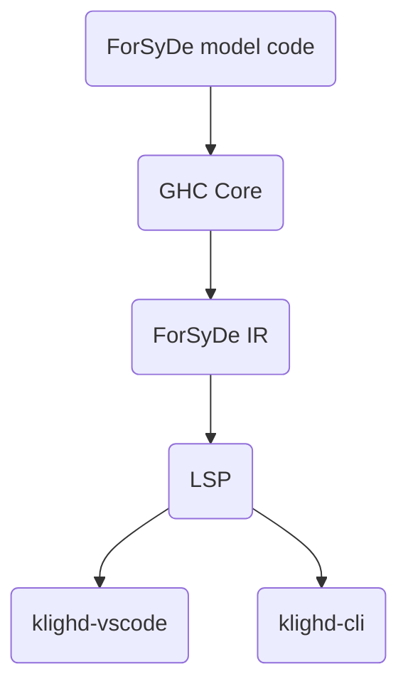

# Visualisation Documentation

## Overview

The ForSyDe visualisation tool uses KIELER diagram technology to graphically visualise ForSyDe models written in Haskell. The specific approach taken is to implement a language server which uses the KIELER diagram server API to communicate with either the KIELER CLI or the KIELER VS Code extension.

The process used is shown in the diagram below. It involves reusing the beginning parts of the compiler. The frontend is used to obtain the ForSyDe IR. The LSP takes the ForSyDe IR which it uses to construct a graph according to the KLighD JSON schema, which KIELER can visualise. This can be communicated to either KLighD VSCode or KLighD CLI, but at this time only the latter is tested.



## LSP

### LSP Client and Server

LSP consists of 3 parts: the code editor, LSP client, and LSP server.
LSP client in VS Code communicates via JSON RPC, with either stdio/stdin or sockets.

For visualisation purposes, our LSP client also needs to notify the KIELER
extension as in this snippet:

```javascript
// Inform the KLighD extension about the LS client and supported file endings
await vscode.commands.executeCommand<string>(
  "klighd-vscode.setLanguageClient",
  lsClient,
  ["model", "osgiviz"],
);
```

### SKGraphSchema

Currently, the [SKGraphSchema](https://github.com/kieler/klighd-vscode/blob/main/schema/klighd/SKGraphSchema.json)
is implemented by manually defining Haskell data types and defining a JSON serialization
with the package Aeson in `src/SKGraphSchema.hs`.
This approach allows us to leave out properties of the schema which we don't need in the project.

The relevant source for the schema is in [skgraph-model.ts](https://github.com/kieler/klighd-vscode/blob/main/packages/klighd-core/src/skgraph-models.ts) in the KLighD-VSCode repository
and can be used for reference with types not yet added to the schema.

#### Properties

The properties supported by ELK can be found [here](https://eclipse.dev/elk/reference.html).
The values of the properties usually take the form of a list.
We currently haven't added the enum names for the property options, but they are usually numbered
with the first starting at zero.
