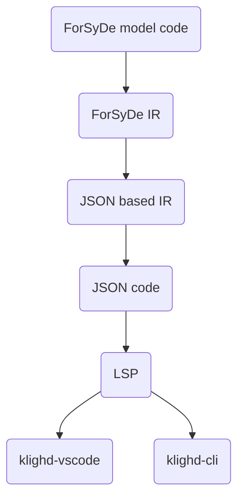

# Visualisation Documentation
The ForSyDe visualisation tool uses KIELER diagram technology to graphically visualise ForSyDe models written in Haskell.  The specific approach taken is to implement a language server which uses the KIELER diagram server API to communicate with either the KIELER CLI or the KIELER VS Code extension.

The process used is shown in the diagram below. It involves reusing the beginning parts of the compiler. The same lexer and parser are used to obtain an AST from the ForSyDe model. This AST is then transformed into a ForSyDe IR. For visualisation, the ForSyDe IR is then transformed into a JSON-based IR. This IR is based on a JSON schema provided by KIELER, which describes the expected messages for their diagram server API. This JSON-based IR is then converted into a JSON file. The JSON file at this point should describe how KIELER can visualise the net list originally described as a ForSyDe model. A language server written in Python then converts the JSON file into Python objects based on the same JSON schema mentioned earlier. The language server then sends messages using the diagram server API to interface with either the KIELER CLI or KIELER VS Code extension.

Converting the JSON schema provided by KIELER into OCaml types is done through the tool `yojson`. While converting the JSON schema into Python types is done using `datamodel-code-generator`.
