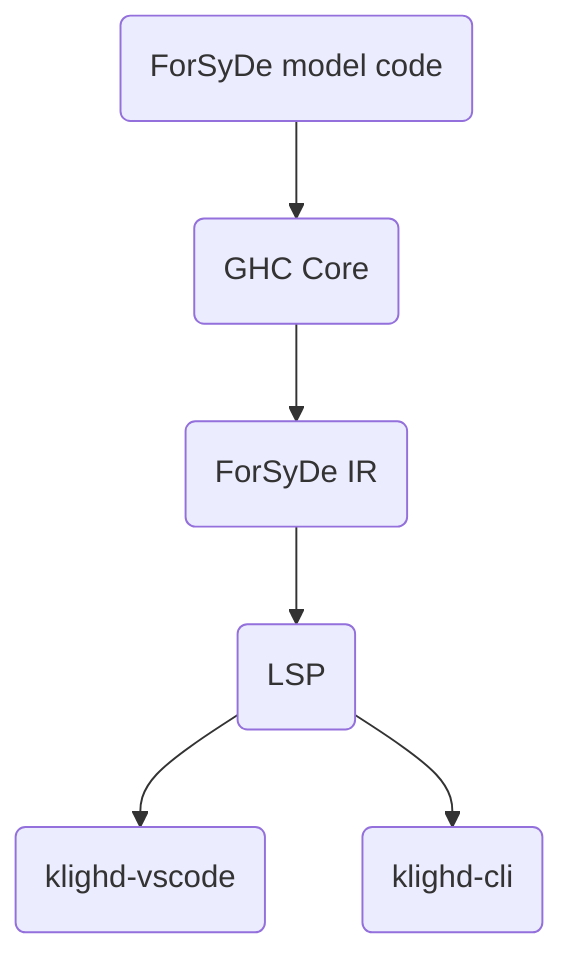

# Visualisation Documentation

## Overview

The ForSyDe visualisation tool uses KIELER diagram technology to graphically visualise ForSyDe models written in Haskell. The specific approach taken is to implement a language server which uses the KIELER diagram server API to communicate with either the KIELER CLI or the KIELER VS Code extension.

The process used is shown in the diagram below. It involves reusing the beginning parts of the compiler. The frontend is used to obtain the ForSyDe IR. The LSP takes the ForSyDe IR which it uses to construct a graph according to the KLighD JSON schema, which KIELER can visualise. This can be communicated to either KLighD VSCode or KLighD CLI, but at this time only the latter is tested.



## LSP

### Running the VSCode extension

In addition to the dependencies of the project, you need [npm](https://nodejs.org/en/learn/getting-started/an-introduction-to-the-npm-package-manager).

There are a few options for how the extension can run the langauge server.
This assumes your current working directory starts at the project top-level.

Nix built package:
```sh
# Build the wrapped Nix package
nix build

# Either:
# Copy the wrapped Nix executable to the vscode extension
mkdir -p vscode-ext/server
cp -f result/bin/forsyde-lsp-exe vscode-ext/server

# Or:
# Copy the wrapped Nix executable to a directory in your PATH:
mkdir -p $HOME/.local/bin
cp -f result/bin/forsyde-lsp-exe $HOME/.local/bin
```

Stack built package:
```sh
# Build and install the package using stack (this should put it in $HOME/.local/bin)
stack install

# Install the forsyde-shallow package globally which makes it available outside of the project
cabal v1-install forsyde-shallow
```

To build the VSCode extension:
```sh
cd vscode-ext
npm install
npm run compile
cd ..
```

You can then launch VSCode with the extension (note that an absolute path is needed):
```sh
code --extensionDevelopmentPath=$PWD/vscode-ext
```

Another option is to install the extension into VSCode. For that you first need [vsce](https://code.visualstudio.com/api/working-with-extensions/publishing-extension).
Then you can:
```sh
vsce package
code --install-extension forsyde-vscode-extension-0.1.0.vsix
```
In this case the extension will be available without specifying the development path.


#### Troubleshooting

Depending on the method used to build the langauge server, it might have trouble finding the forsyde-shallow package.
In that case it can be specified manually in the VSCode settings for the extension.
If installed with stack, it can be found with `find $HOME/.stack -name '*forsyde-shallow*' | grep -o '^.*/pkgdb'`.
If there are multiple results, choose the GHC version which matches with the one used in the project (as of writing 9.10.2).

### Running with KLighD-CLI

The LSP server is a separate executable, `forsyde-lsp-exe`. One can either let the LSP
get the file from the LSP client or specify a separate one which will be used for input
regardless of what the LSP client sends.

To run the visualizer:

```sh
cabal run forsyde-lsp-exe
# In a separate shell
./klighd-linux --ls_port 5007 <path/to/model.hs>
```

This will open up a new tab in the browser with the visualizer.

### LSP Client and Server

LSP consists of 3 parts: the code editor, LSP client, and LSP server.
LSP client in VS Code communicates via JSON RPC, with either stdio/stdin or sockets.

For visualisation purposes, our LSP client also needs to notify the KIELER
extension as in this snippet:

```javascript
// Inform the KLighD extension about the LS client and supported file endings
await vscode.commands.executeCommand<string>(
  "klighd-vscode.setLanguageClient",
  lsClient,
  ["model", "osgiviz"],
);
```

### SKGraphSchema

Currently, the [SKGraphSchema](https://github.com/kieler/klighd-vscode/blob/main/schema/klighd/SKGraphSchema.json)
is implemented by manually defining Haskell data types and defining a JSON serialization
with the package Aeson in `src/SKGraphSchema.hs`.
This approach allows us to leave out properties of the schema which we don't need in the project.

The relevant source for the schema is in [skgraph-model.ts](https://github.com/kieler/klighd-vscode/blob/main/packages/klighd-core/src/skgraph-models.ts) in the KLighD-VSCode repository
and can be used for reference with types not yet added to the schema.

#### Properties

The properties supported by ELK can be found [here](https://eclipse.dev/elk/reference.html).
The values of the properties usually take the form of a list.
We currently haven't added the enum names for the property options, but they are usually numbered
with the first starting at zero.
